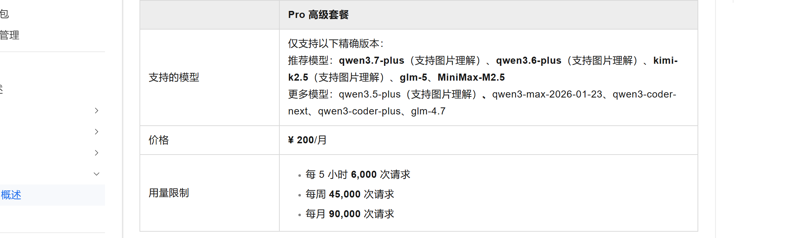
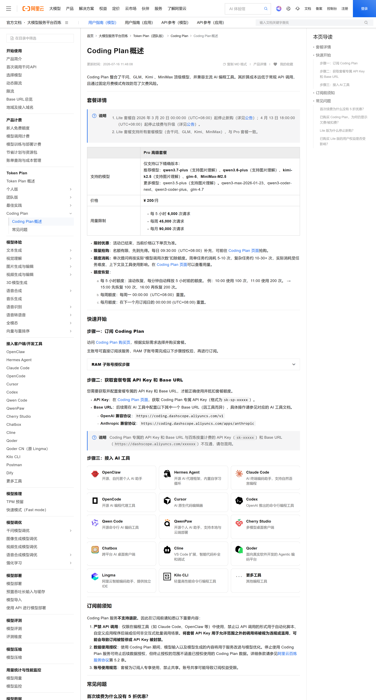
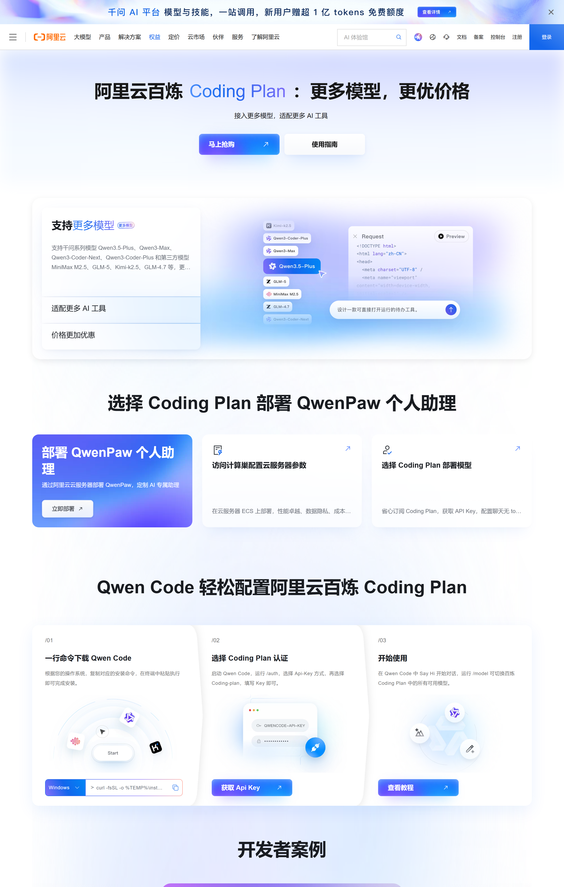
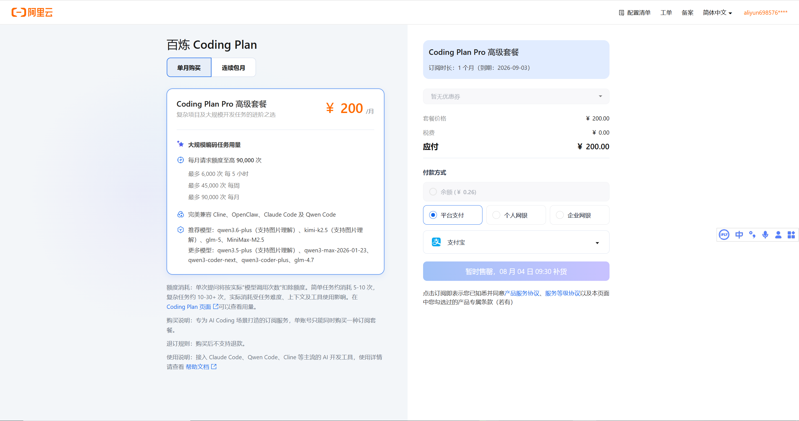

# Master Report: 阿里云百炼

> **用途**：写 `data/vendors/alibaba.yml` 与 `data/plans/alibaba-bailian-coding-plan-pro.yml` 的唯一参考。
> **raw evidence**：`data/alibaba/official/2026-08-04_*.md` + `*_screenshot.png`（7 个文件）
> **数据日期**：2026-08-04（官方文档更新时间 2026-07-16 / FAQ 2026-08-01）

## 1. 收录决策

| 项 | 决策 | 原因 |
|---|---|---|
| 厂商 | ✅ 收录 | 多模型聚合站（千问+GLM+Kimi+MiniMax），是榜单缺口 |
| 套餐 | ✅ 仅 Pro（¥200/月） | Lite 已 deprecated，2026-03-20 停新购 / 04-13 停续费 |
| 数据完整度 | 92% | 价格/限额/模型/工具/风险全齐；token 口径官方明示缺失 |

## 2. 厂商基础字段（vendor.yml 草稿）

```yaml
vendor_id: alibaba
vendor_display: 阿里云百炼
vendor_display_en: Alibaba Cloud Model Studio / Bailian
brand_color: "#FF6A00"           # 阿里橙，待截图校对
homepage: https://bailian.console.aliyun.com/
docs: https://help.aliyun.com/zh/model-studio/
shared_features:
  primary_model: qwen3.7-plus    # 官方推荐列首位
  models:
    - qwen3.7-plus
    - qwen3.6-plus
    - kimi-k2.5
    - glm-5
    - MiniMax-M2.5
    - qwen3.5-plus
    - qwen3-max-2026-01-23
    - qwen3-coder-next
    - qwen3-coder-plus
    - glm-4.7
  clients:
    - OpenClaw
    - Hermes Agent
    - Claude Code
    - OpenCode
    - Cursor
    - Codex
    - Qwen Code
    - QwenPaw
    - Cline
    - Qoder
    - Cherry Studio
    - Chatbox
last_verified: 2026-08-04
affiliate: null                  # 未发现 Coding Plan 专属邀请码
```

## 3. 套餐字段（plan.yml 草稿 — Pro 唯一档）

```yaml
plan_id: alibaba-bailian-coding-plan-pro
vendor: alibaba
plan_name: Coding Plan Pro 高级套餐
plan_tier: pro
status: active                   # 需每日 09:30 UTC+8 抢购
last_verified: 2026-08-04

pricing:
  currency: CNY
  original_monthly: 200          # 官方"价格 ¥ 200/月"
  original_quarterly: null       # 官方未公布（仅按月订阅）
  original_yearly: null          # 官方明示"暂无年付套餐"
  intro_monthly: null            # 限时优惠已结束（控制台显示"新手优惠 30 天 6.25 折"待用户确认是否写入）
  intro_renewal_discount: null   # 首次续费 5 折已于 2026-04-01 结束
  auto_renew_default: true
  price_warning: |
    不支持退款、不支持降配；数据用于模型训练与优化。

limits:
  window_5h:
    requests_official: 6000      # 滚动恢复，每分钟释放 5h 前额度
    tokens_measured: null
    tokens_official_claimed: null
  window_weekly:
    requests_official: 45000     # 周一 00:00 UTC+8 重置
    tokens_measured: null
    tokens_official_claimed: null
  window_monthly:
    requests_official: 90000     # 订阅日次月对应日 00:00 UTC+8 重置
    tokens_measured: null
    tokens_official_claimed: null

# 关键：单位是"模型调用次数"，不是 tokens
# 官方明示"额度消耗与 Token 消耗无关"，所以 tokens_* 全 null
# 单次请求消耗 5-30 次（官方：简单任务 5-10 / 复杂任务 10-30+）
# 详见铁律 20：claimed-only 状态需用 data_status_declaration measurement 明示

claimed_unit: "次"

# 铁律 28：availability 是决定性约束（能否订阅），不能藏在 risk_flags
availability:
  status: limited_quota
  restock_schedule: "每日 09:30 UTC+8"
  restock_method: "先到先得"
  fail_open_behavior: "售罄即不可订阅（fail-closed）"
  last_verified: 2026-08-04
  source: "data/alibaba/official/2026-08-04_user_console_screenshot.png"

risk_flags:
  - 严禁 API 调用（仅限交互式编程工具）
  - 不支持退款
  - 禁止账号共享
  - 数据用于模型训练与优化
  - 不可降配（Pro → Lite）
  - 单一订阅（每账号只能持有 1 个 Coding Plan）

evidence_path: data/alibaba/official/2026-08-04_bailian_coding_plan_official.md
```

## 4. 数据完整性自评

| 字段 | 状态 | 备注 |
|---|---|---|
| vendor_id | ✅ | — |
| vendor_display | ✅ | — |
| brand_color | ⚠️ 阿里橙 | 需用官方 logo 校准 hex |
| homepage / docs | ✅ | — |
| primary_model | ✅ | qwen3.7-plus（官方推荐列首位） |
| 模型白名单 | ✅ | 10 个 model_id 逐字符匹配 |
| Pro 价格 | ✅ | ¥200/月（官方文档原文） |
| Pro 三窗口额度 | ✅ | 6,000 / 45,000 / 90,000 |
| Lite 数据 | ❌ | 官方已下架，网络流传"Lite ¥40/1200/9000/18000"全是 CSDN 二手推算 |
| tokens_official_claimed | ❌ | 官方明示"无法查看 Token 消耗"，必须 null |
| tokens_measured | ❌ | 无探针数据 |
| 邀请码 | ❌ | 未发现 Coding Plan 专属推荐返现 |
| 并发上限 | ❌ | 官方只说"动态调整"，无 RPM/RPS 公布 |

## 5. 自洽性验算（铁律 22）

| 检查 | 计算 | 结论 |
|---|---|---|
| 5h → 周 | 一周 = 168h = 33.6 个 5h 窗口；6,000 × 33.6 = 201,600 vs 官方 45,000 | **周先撞**（≈ 7.5 个满 5h 窗口） |
| 周 → 月 | 45,000 × 4.286 = 192,857 vs 官方 90,000 | **月 = 周 × 2**（整数倍硬封顶，与火山方舟同型） |
| 铁律 6（月 ≤ 周 × 5） | 90,000 / 45,000 = 2.0 | ✅ 通过 |

**真实瓶颈判定**：月额度 90,000 次 = 2 个满周额度；用户一个月内最多"跑满 2 周"。5h 窗口几乎不可能先撞。

## 6. 截图（论文式内嵌）

**图 1：套餐详情表特写（价格 ¥200/月 + 三窗口数字肉眼可读）**



*来源：[help.aliyun.com/zh/model-studio/coding-plan](https://help.aliyun.com/zh/model-studio/coding-plan)（官方帮助文档 · 2026-07-16 更新） · 抓取：chrome --headless --screenshot 2x scale · 日期：2026-08-04*
*路径：`C:/Users/520hh/Desktop/项目/llm-api-ledger/data/alibaba/official/2026-08-04_bailian_coding_plan_pricing_table_screenshot.png`*

---

**图 2：概述页全屏（2800×5200，含 Lite 停售公告 + Pro 套餐详情）**



*来源：[help.aliyun.com/zh/model-studio/coding-plan](https://help.aliyun.com/zh/model-studio/coding-plan)（官方帮助文档 · 2026-07-16 更新） · 抓取：chrome --headless --screenshot 全屏 · 日期：2026-08-04*
*路径：`C:/Users/520hh/Desktop/项目/llm-api-ledger/data/alibaba/official/2026-08-04_bailian_coding_plan_overview_screenshot.png`*

---

**图 3：营销页全屏（2800×4400，模型列表已过期）**



*来源：[aliyun.com/benefit/scene/codingplan](https://www.aliyun.com/benefit/scene/codingplan)（官方营销/抢购页） · 抓取：chrome --headless --screenshot 全屏 · 日期：2026-08-04*
*路径：`C:/Users/520hh/Desktop/项目/llm-api-ledger/data/alibaba/official/2026-08-04_bailing_codingplan_scene_page_screenshot.png`*

---

**图 4：控制台购买页实测（用户已登录 / 2026-08-04 实拍）**



*来源：阿里云控制台 `bailian.console.aliyun.com/cn-beijing/?tab=plan#/efm/subscription/coding-plan`（用户已登录实测） · 抓取：人工截图（用户提供 ScreenShot_2026-08-04_030117_456.png） · 日期：2026-08-04*
*路径：`C:/Users/520hh/Desktop/项目/llm-api-ledger/data/alibaba/official/2026-08-04_user_console_screenshot.png`（已入库）*

**与 evidence 差异摘要**（详见 §9）：
- 控制台推荐模型列首位 = **qwen3.5-plus**（vs evidence 帮助文档 = qwen3.7-plus）
- 控制台显示**新手优惠 30 天 6.25 折**（vs evidence 文档 = 活动已结束）
- 数据使用授权原文 = "**模型训练**和优化"（vs evidence = "服务改进与模型优化"）
- 限量抢购红字 = "**每日 09:30 限量补货**" + "**售完即不可订阅**"（应作为独立 `availability` 字段）

## 7. 来源 URL（全部已抓）

| URL | 类型 | 状态 |
|---|---|---|
| https://help.aliyun.com/zh/model-studio/coding-plan | 官方帮助 · 概述（**权威源**） | ✅ |
| https://help.aliyun.com/zh/model-studio/coding-plan-faq | 官方帮助 · 常见问题 | ✅ |
| https://www.aliyun.com/benefit/scene/codingplan | 营销/抢购页（无数字） | ✅ |
| https://common-buy.aliyun.com/coding-plan | 下单页（302 跳登录） | ❌ 抓不到 |
| https://www.aliyun.com/notice/118094 | 公告 · Lite 停新购 | ✅ |
| https://www.aliyun.com/notice/118175 | 公告 · Lite 停续费与升级 | ✅ |
| https://bailian.console.aliyun.com/.../coding-plan | 控制台 Coding Plan | ❌ 需登录 |

## 8. 风险 / 注意事项

- **限量抢购**：每日 09:30（UTC+8）补货；售罄不可订阅
- **不可退款 + 不可降配**
- **数据用于模型优化**：用户输入/输出会用于服务改进
- **严禁 API 调用**：仅限交互式编程工具，自动化脚本/批量调用违规封号
- **账号禁止共享**：检测到 Key 公开泄露自动禁用
- **API Key 专属**：`sk-sp-xxxxx`，Base URL 必须 `coding.dashscope.aliyuncs.com`；误用通用 Key/URL 走按量计费
- **服务周期按自然月**：2 月开通可能只有 28 天
- **每账号只能持 1 个 Coding Plan**

## 9. 不确定 / 存疑

### 来源差异（控制台 vs 官方文档 vs 营销页）

| 项 | 官方帮助文档（2026-07-16） | 控制台（2026-08-04 实测） | 营销页（未指定日期） | 决策 |
|---|---|---|---|---|
| 推荐模型列首位 | qwen3.7-plus（含图片理解） | **qwen3.5-plus**（含图片理解） | qwen3.5-plus | **待用户拍板**（控制台是用户实际下单界面，可能更准） |
| qwen3.7-plus 是否在白名单 | ✅ 在"更多模型"列 | ❓ 控制台未显示 | ❌ 无 | 写 yml 时白名单只列控制台展示的 7 个模型？ |
| 新手优惠 | 官方文档说"活动已结束" | **"新手优惠 30 天 6.25 折"** | 营销页说"首购 7.9 元/39.9 元" | 写 yml `intro_*` 字段？ |
| 数据使用授权原文 | "将用于服务改进与模型优化" | "Coding Plan 期间产生的输入和输出数据将用于**模型训练**和优化" | — | 差异在 "服务改进" vs "模型训练"，后者更激进 |

### 限量抢购具体表述

> 用户控制台显示（**决定性约束，必须作为独立字段**）：
> - "**每日 09:30 限量补货**"
> - "**售完即不可订阅**"
>
> 当前 yml 草稿只在 `risk_flags` 数组里有一项，应提升为**独立 `availability` 字段**（不能藏在风险列表里）：
>
> ```yaml
> availability:
>   status: limited_quota
>   restock_schedule: "每日 09:30 UTC+8"
>   restock_method: "先到先得"
>   fail_open_behavior: "售罄即不可订阅（fail-closed）"
> ```
>
> `availability.status` 至少三种取值：`unlimited` / `limited_quota` / `waitlist`，**未来 lint 必须校验**这个字段存在。

### 其他细节（之前漏抓）

1. **订购时间**：用户控制台显示订购时长 1 个月（自动续费至 2026-09-01），这意味着默认订阅周期是**自然月滚动**而非固定日
2. **结算方式字段**：
   - 包年：¥0.00（不可，与 evidence 一致）
   - 包月：¥200.00
   - 应付：¥200.00（无折扣）
3. **付款方式**：信用卡（aliyun4936\*\*\*\*\*\*）+ 个人限购 / 企业限购 选项
4. **数据使用授权原文**："Coding Plan 期间产生的输入和输出数据将用于**模型训练**和优化" — 注意是 "模型训练"（更激进）而不是 evidence 写的"服务改进"
5. **支付宝**支付方式 — 中国大陆常见，但 yml 不需要写支付方式字段
6. **品牌色**：建议用阿里橙但需要 hex 精确值（截图校对后填 `#FF6A00` 候选）
7. **Lite 档官方价格与限额**：官方已下架且无存档，必须 null

## 10. 一句话总结

阿里云百炼 Coding Plan **Pro ¥200/月**，5h/周/月 = 6,000/45,000/90,000 次模型调用，10 个模型白名单（千问主力），月=2×周硬封顶（与火山方舟同型），限量抢购不可退款。