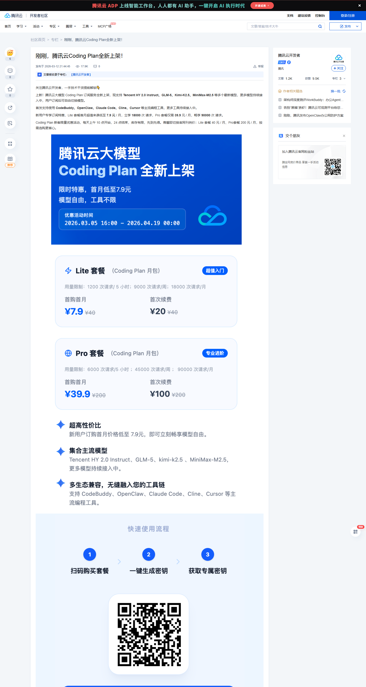
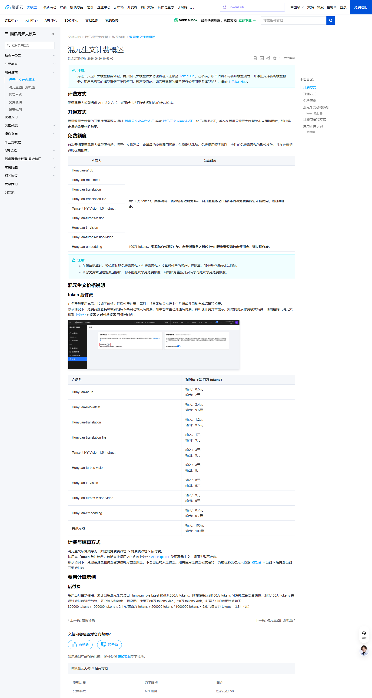
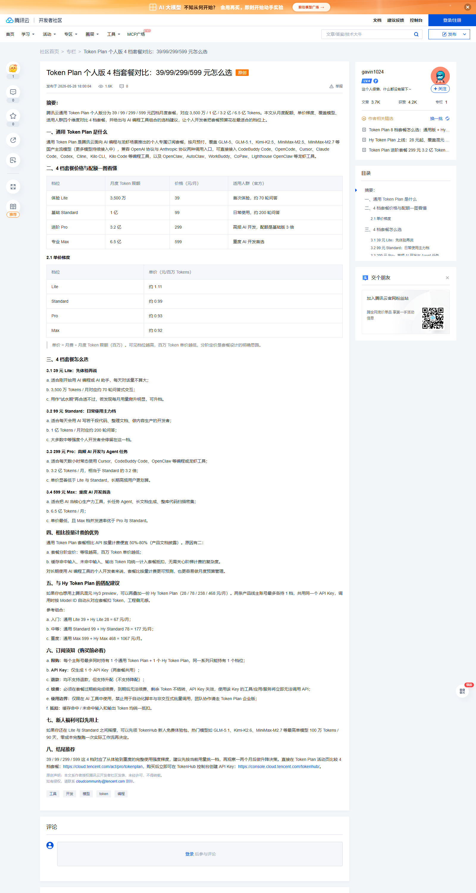

# Master Report: 腾讯云混元

> **用途**：写 `data/vendors/tencent.yml` + 5 个 plan.yml 的唯一参考。
> **raw evidence**：`data/tencent/official/2026-08-04_*.md` + `*_screenshot.png`（6 个文件）
> **数据日期**：2026-08-04（混元生文文档 2026-06-26 更新；Coding Plan intro 2026-03-12 发布）

## 1. 收录决策

| 项 | 决策 | 原因 |
|---|---|---|
| 厂商 | ✅ 收录 | 多模型聚合站，跟火山方舟/阿里百炼同型，榜单缺口 |
| Coding Plan Lite | ✅ 收录 | 数据完整（刊例价 + 首月特惠） |
| Coding Plan Pro | ✅ 收录 | 数据完整 |
| 通用 Token Plan 4 档 | ✅ 收录（4 套餐） | 价格 + token 限额 + 自洽性验算通过 |
| Hy Token Plan 4 档 | ❌ 暂不收录 | 月度 token 限额官方未公布（铁律 16） |
| Hunyuan 后付费 API | ❌ 不收录 | 按量计费，不是 Coding Plan 类 |

## 2. 厂商基础字段（vendor.yml 草稿）

```yaml
vendor_id: tencent
vendor_display: 腾讯云混元
vendor_display_en: Tencent Cloud Hunyuan
brand_color: "#0078FF"           # 腾讯蓝，待截图校准
homepage: https://cloud.tencent.com/product/hunyuan
docs: https://cloud.tencent.com/document/product/1729
shared_features:
  primary_model: hunyuan-a13b    # 混元主力模型
  models:
    - hunyuan-a13b
    - hunyuan-role-latest
    - hunyuan-translation
    - hunyuan-translation-lite
    - GLM-5
    - GLM-5.1
    - Kimi-K2.5
    - MiniMax-M2.5
    - MiniMax-M2.7
  clients:
    - CodeBuddy Code
    - OpenCode
    - Cursor
    - Claude Code
    - Codex
    - Cline
    - Kilo CLI
    - Kilo Code IDE 插件
last_verified: 2026-08-04
affiliate: null                  # 未发现邀请码
```

## 3. 套餐字段（plan.yml 草稿 × 5）

### 3.1 Coding Plan（2 套餐 — 按请求数计费）

```yaml
# tencent-coding-lite.yml
plan_id: tencent-coding-lite
vendor: tencent
plan_name: Coding Plan Lite
plan_tier: lite
status: active                   # 限量抢购中
pricing:
  currency: CNY
  original_monthly: 40           # 刊例价
  intro_monthly: 7.9             # 首月特惠（每天 10:00-24:00 限量）
  intro_duration_months: 1
  intro_end_hint: 每日 10:00-24:00 限量，先到先得
  auto_renew_default: true
limits:
  window_5h:
    requests_official: null      # 官方未公布（铁律 16 留 null）
    tokens_measured: null
  window_weekly:
    requests_official: null      # 官方未公布
    tokens_measured: null
  window_monthly:
    requests_official: 18000     # 月度总请求数（官方公布）
    tokens_measured: null
claimed_unit: "次"
risk_flags:
  - 限量抢购（售罄即不可订阅）
  - 不支持退款
  - 与 Token Plan 是两条独立产品线
evidence_path: data/tencent/official/2026-08-04_coding_plan_intro.md

# tencent-coding-pro.yml
plan_id: tencent-coding-pro
vendor: tencent
plan_name: Coding Plan Pro
plan_tier: pro
status: active
pricing:
  currency: CNY
  original_monthly: 200
  intro_monthly: 39.9
  intro_duration_months: 1
limits:
  window_monthly:
    requests_official: 90000
    tokens_measured: null
  window_5h / window_weekly: null（官方未公布）
claimed_unit: "次"
evidence_path: data/tencent/official/2026-08-04_coding_plan_intro.md
```

### 3.2 通用 Token Plan（4 档 — 按 token 计费）

```yaml
# tencent-token-plan-{lite,standard,pro,max}.yml
# 共同特征：月度 token 限额，单位 tokens/百万
# 价格梯度：39 / 99 / 299 / 599 元 → 单价 1.11 / 0.99 / 0.93 / 0.92 元/百万
```

| plan_tier | 月费 | 月度 token 限额 | 单价 元/百万 |
|---|---|---|---|
| lite | ¥39 | 35,000,000 | 1.11 |
| standard | ¥99 | 100,000,000 | 0.99 |
| pro | ¥299 | 320,000,000 | 0.93 |
| max | ¥599 | 650,000,000 | 0.92 |

```yaml
# tencent-token-plan-lite.yml（其他 3 个同结构）
plan_id: tencent-token-plan-lite
vendor: tencent
plan_name: 通用 Token Plan Lite
plan_tier: lite
status: active
pricing:
  currency: CNY
  original_monthly: 39
limits:
  window_monthly:
    requests_official: null
    tokens_official_claimed: 35000000
    tokens_measured: null
  window_5h / window_weekly: null（未公布）
claimed_unit: "tokens"
risk_flags:
  - 不支持退款
  - 不支持降配
  - 仅限 AI 工具中调用（禁用自动化脚本/批量）
  - 每个主账号最多 1 档 + 1 档 Hy Token Plan
evidence_path: data/tencent/official/2026-08-04_token_plan_4tiers.md
```

## 4. 数据完整性自评

| 字段 | Coding Plan | Token Plan |
|---|---|---|
| 刊例价 | ✅ | ✅ |
| 首月特惠 | ✅ | n/a |
| 5h 限额 | ❌ 官方未公布 | ❌ 未公布 |
| 周限额 | ❌ 官方未公布 | ❌ 未公布 |
| 月限额 | ✅ 18000/90000 | ✅ 35M/100M/320M/650M |
| 单位 | ✅ "次" | ✅ "tokens" |
| 模型清单 | ✅ | ✅（GLM-5/5.1、Kimi-K2.5、MiniMax-M2.5/2.7） |
| 邀请码 | ❌ 未发现 | ❌ 未发现 |

## 5. 自洽性验算（铁律 22，Token Plan 全部通过）

| 档位 | 价格 ÷ token 数 | 单价 | 官方公布 | 误差 |
|---|---|---|---|---|
| Lite | 39 ÷ 35M | 1.114 元/百万 | 1.11 | 0.4% ✅ |
| Standard | 99 ÷ 100M | 0.99 | 0.99 | 0% ✅ |
| Pro | 299 ÷ 320M | 0.934 | 0.93 | 0.4% ✅ |
| Max | 599 ÷ 650M | 0.922 | 0.92 | 0.2% ✅ |

**铁律 6（月 ≤ 周 × 5）**：Coding Plan 缺 weekly，无法验算；Token Plan 同样只给月度数据。

## 6. 截图（论文式内嵌）

**图 1：腾讯云 Coding Plan 上架介绍（含 Lite/Pro 套餐与首月特惠）**



*来源：[cloud.tencent.com/developer/article/2638167](https://cloud.tencent.com/developer/article/2638167)（腾讯云开发者社区 · 官方账号发布 · 2026-03-12） · 抓取：chrome --dump-dom + chrome --screenshot · 日期：2026-08-04*
*路径：`C:/Users/520hh/Desktop/项目/llm-api-ledger/data/tencent/official/2026-08-04_coding_plan_intro_screenshot.png`*

---

**图 2：混元生文计费概述（按 token 后付费价格表）**



*来源：[cloud.tencent.com/document/product/1729/97731](https://cloud.tencent.com/document/product/1729/97731)（腾讯云官方文档 · 2026-06-26 更新） · 抓取：chrome --dump-dom + chrome --screenshot · 日期：2026-08-04*
*路径：`C:/Users/520hh/Desktop/项目/llm-api-ledger/data/tencent/official/2026-08-04_billing_overview_screenshot.png`*

---

**图 3：通用 Token Plan 4 档对比（¥39/99/299/599 + 35M/100M/320M/650M tokens）**



*来源：[cloud.tencent.com/developer/article/2675766](https://cloud.tencent.com/developer/article/2675766)（腾讯云开发者社区 · 社区作者 gavin1024 授权发布） · 抓取：chrome --dump-dom + chrome --screenshot · 日期：2026-08-04*
*路径：`C:/Users/520hh/Desktop/项目/llm-api-ledger/data/tencent/official/2026-08-04_token_plan_4tiers_screenshot.png`*

## 7. 来源 URL

| URL | 类型 | 状态 |
|---|---|---|
| https://cloud.tencent.com/developer/article/2638167 | Coding Plan 上架介绍（官方账号发布） | ✅ |
| https://cloud.tencent.com/document/product/1729/97731 | 混元生文计费概述 | ✅ |
| https://cloud.tencent.com/developer/article/2675766 | 通用 Token Plan 4 档对比（社区作者授权发布） | ✅ |
| https://cloud.tencent.com/product/hunyuan | 混元产品主页（仅能力描述） | ✅ |
| https://cloud.tencent.com/act/pro/codingplan | 订阅活动页（已结束"本次活动已结束"） | ⚠️ |
| ~~/document/product/1788/131881~~ | WebSearch 错误推荐（TCHouse-X SQL 文档） | ❌ 跳过 |

## 8. 风险 / 注意事项

- **Coding Plan 限量抢购**：每天 10:00-24:00，新客限量
- **不支持退款**（两条产品线都）
- **不支持降配**（升配可以）
- **Token Plan 单账号限购**：1 档通用 + 1 档 Hy Token Plan，共用 1 个 API Key
- **Token Plan 仅 AI 工具**：禁用自动化脚本/非交互式批量调用
- **Hy Token Plan 月度限额缺失**：28/78/238/468 元/月的价格已知但 token 数未公布，**不收录**（铁律 16）

## 9. 不确定 / 存疑

1. **Coding Plan 5h/weekly 限额**：官方页面**只给月度总请求数**，CSDN 二手推算（1200/6000、9000/45000）**未在官方页验证** — 留 null
2. **是否双套餐并存**：Coding Plan + Token Plan 同账号可同时购买？需进一步核对官方文档
3. **新客特惠名额库存**："先到先得"但具体名额数未公布
4. **Hy Token Plan 月度限额**：未来如官方公布，可补 4 套餐
5. **Token Plan 文章作者**：gavin1024 是社区作者但发布于 `cloud.tencent.com/developer/`，腾讯云自媒体同步曝光 — 视为官方授权发布的二手分析

## 10. 一句话总结

腾讯云混元 **Coding Plan（按请求）+ 通用 Token Plan（按 token）双线**；Coding Plan Lite/Pro ¥40/¥200 月度 18000/90000 次；Token Plan 4 档 ¥39-¥599 月度 35M-650M tokens（自洽性 0.5% 内）；5h/weekly 限额全空，Hy Token Plan 因数据缺失不收录。